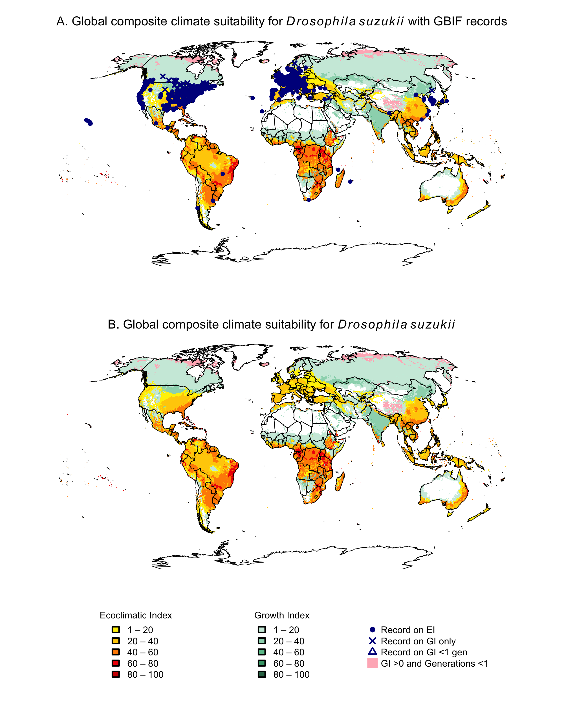
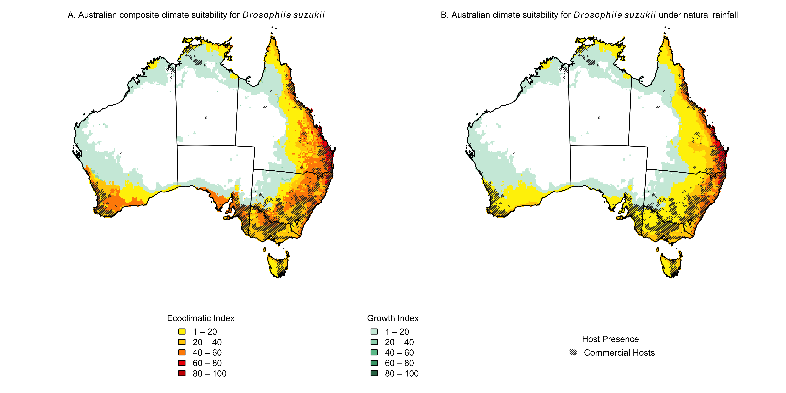
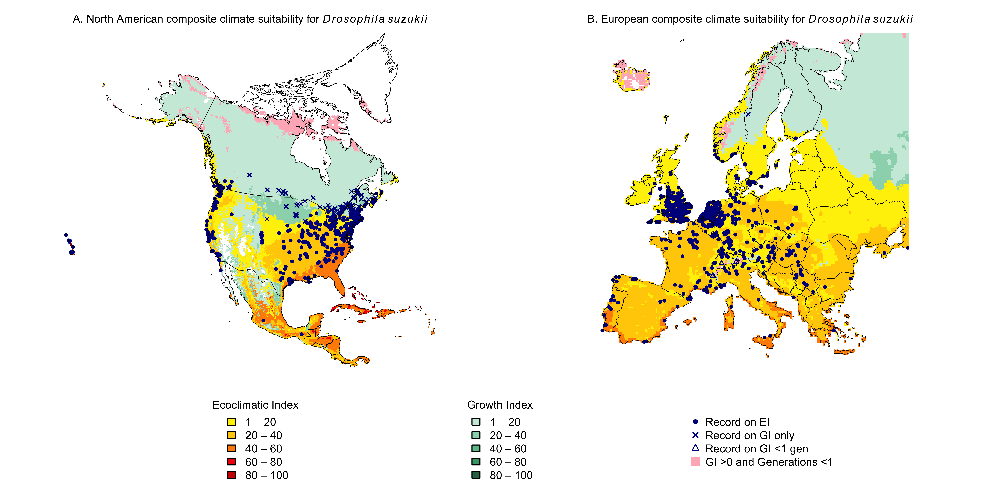

```{css, echo=FALSE}
.csl-entry { margin-bottom: 1.5em; }
```

### Rmd purposes

**Aim and context:** This Rmd file was used to map the global distribution via GBIF occurrence records of *Drosophila suzukii* against the CLIMEX model outputs of permanently and ephemerally suitable climates. The CLIMEX results for the Ecoclimatic Index (EI), Growth Index (GI, where generations \>1), and ephemeral suitability (GI\>0, generations \<1) are mapped as a composite of maximum values from the global area under irrigation (run under a 2.5mL daily top-up irrigation scenario and identified using GirrEO earth observation data), and the natural rainfall CLIMEX results. See @yonow2017 for an explanation of the logic involved in composite CLIMEX maps. For Australia, the composite CLIMEX results are overlain with the extent of commercial host growing regions as defined by ABARES.

**Output:** This file was used to map composite CLIMEX results and GBIF records for a global map, North America and Europe, and Australia.

**Note:** this Rmd file requires CLIMEX outputs of GI and EI, as well as GirrEO data from @lopezsaldana2025.

### Libraries and data setup

- Read in libraries
- Import both natural rainfall and irrigated scenario CLIMEX CSV files for a global extent
  - Run CLIMEX species model for CM10 World with Irrigation Not Set. Select Results \> File \> New \> Multiple.
  - Select Latitude, Longitude, EI, GI, and Generations, then save format and save as CSV within the R project folder.
  - Repeat for the irrigated dataset by changing Irrigation to 2.5 ml/day top-up for both summer and winter scenarios.
- Import global boundary file for mapping
- Import *D. suzukii* shapefile

```{r setup, message = FALSE}
library(rnaturalearth)     # global boundaries
library(rnaturalearthdata) # global boundaries
library(sp)                # GIS manipulation
library(terra)             # GIS manipulation
library(ozmaps)            # Australian boundaries
library(sf)                # GIS manipulation

irrigated <- read.csv("D_suzukii_world_10_EI_GI_gens_irrigated.csv", skip = 2)
natural <- read.csv("D_suzukii_world_10_EI_GI_gens_none.csv", skip =2)

world_boundary <- ne_countries(scale = "medium", returnclass = "sf") # import global country boundaries
world_boundary <- vect(world_boundary)                               # convert to terra format
data("ozmap_states")                                                 # Australia State and Territory boundaries

records <- vect("d.suzukii.shp")                                     # read in GBIF records
hosts <- rast("abares_modal_hosts.tif")                              # host data
```

### Rasterise irrigated and non-irrigated outputs

- Convert CSV data to vector format as an interim, as the CLIMEX data are natively in vector format
- Set raster resolution, global limits, and CRS (WGS84, i.e. no projection)
- Convert vector data to raster data for plotting
  - The Generations data will cover a wider range under an irrigated scenario where Dry Stress is reduced, so the natural data on Generations is moot

```{r rasterise}
irrigated_points <- vect(irrigated, geom=c("Longitude", "Latitude")) # vectorise CSV as an interim step
natural_points <- vect(natural, geom=c("Longitude", "Latitude"))     # vectorise CSV as an interim step

r_global <- rast(resolution=0.16667, xmin=-180, xmax=180, ymin=-90, ymax=90, crs="EPSG:4326") # 10 arc-min grid
irr_ei <- rasterize(irrigated_points, r_global, field="EI") # rasterise irrigated vector data to specified resolution for EI
irr_gi <- rasterize(irrigated_points, r_global, field="GI") # rasterise irrigated vector data to specified resolution for GI
nat_ei <- rasterize(natural_points, r_global, field="EI")   # rasterise natural vector data to specified resolution for EI
nat_gi <- rasterize(natural_points, r_global, field="GI")   # rasterise natural vector data to specified resolution for GI
generations <- rasterize(irrigated_points, r_global, field="Generations") # rasterise irrigated vector data to specified resolution for Generations
```

### Import GirrEO tif, clip to EI and GI

- Import the GirrEO tif downloaded from @lopezsaldana2025
- Resample GirrEO extent to r_global
- Clip irrigated EI and GI to GirrEO dataset
- Clean zeros to NA in all rasters

```{r girreo}
girreo <- rast("Assimila_IrrigatedAreas_candidate_EVI_idx_Global_2023_irrigation_mask_0.1666667Deg.tif")
girreo <- resample(girreo, r_global,  method="near")
irr_ei_clipped <- mask(irr_ei, girreo, maskvalues=0)
irr_gi_clipped <- mask(irr_gi, girreo, maskvalues=0)

nat_ei[nat_ei == 0] <- NA 
nat_gi[nat_gi == 0] <- NA
irr_ei_clipped[irr_ei_clipped == 0] <- NA
irr_gi_clipped[irr_gi_clipped == 0] <- NA
generations[generations == 0]     <- NA
```

### Build composite EI, GI, and mutually exclusive display layers

- Overlay clipped irrigated EI onto EI w/natural rainfall.
- Set colours and breaks.
- Repeat for GI.
- Set values where generations \<1 but GI \>0.

```{r composites}
comp_ei <- max(nat_ei, irr_ei_clipped, na.rm=TRUE)
comp_ei[comp_ei == 0] <- NA
ei_breaks <- c(1, 20, 40, 60, 80, 100)
ei_cols <- c("#FEF001", "#FFCE03", "#FF8C00", "#F00505", "#CC0000")

comp_gi <- max(nat_gi, irr_gi_clipped, na.rm=TRUE)
comp_gi[comp_gi == 0] <- NA
gi_breaks <- c(1, 20, 40, 60, 80, 100)
gi_cols <- c("#CDEBDD", "#9CD6BB", "#6AC299", "#43A276", "#2F7152")

comp_gi_with_gens <- comp_gi             # EI = 0 + generations >= 1
comp_gi_with_gens[!is.na(comp_ei)] <- NA
comp_gi_with_gens[generations < 1] <- NA

no_generations <- comp_gi                # EI = 0 + generations < 1
no_generations[!is.na(comp_ei)] <- NA
no_generations[generations >= 1] <- NA
```

### Classify GBIF occurrence records by suitability zone

- Classify whether records fall within EI\>0, GI\>0 and generations \>1, GI\>0 and generations \<1, or none of the above

```{r gbifrecs}
plot_if_nonempty <- function(pts, use_points=FALSE, ...) {
  if (length(pts) > 0) {
    if (use_points) {coords <- as.data.frame(geom(pts)[, c("x", "y")])
      points(coords, ...) } else {
      plot(pts, ...)}  }}

ei_vals <- terra::extract(comp_ei, records)[,2]
gi_vals <- terra::extract(comp_gi_with_gens, records)[,2]
ng_vals <- terra::extract(no_generations, records)[,2]

ei_pts <- records[!is.na(ei_vals), ]
gi_pts <- records[is.na(ei_vals) & !is.na(gi_vals), ]
ng_pts <- records[is.na(ei_vals) & is.na(gi_vals) & !is.na(ng_vals), ]
```

### Project to Robinson

- Define Robinson projection
- Extend composite maps
- Project EI, GI, Generations, records, and world boundary

```{r robinson, message = FALSE, warning = FALSE}
robinson <- "+proj=robin"

comp_ei_robin <- project(comp_ei, robinson, method="near")
comp_gi_robin <- project(comp_gi_with_gens, robinson, method="near")
no_generations_robin <- project(no_generations, robinson, method="near")
ei_pts_robin <- project(ei_pts, robinson)
gi_pts_robin <- project(gi_pts, robinson)
ng_pts_robin <- project(ng_pts, robinson)

world_boundary_robin <- project(world_boundary, robinson)
```

### Overlay global composite EI, GI, and GBIF occurrence records

The high record density in Eurasia and North America reduces visual detail when GBIF records are included, but these dta are critical to the mapping process. As such, the global data are mapped with and without the GBIF records.

- Turn export line and dev.off() on for exports and off for in-R visuals
- Can export in other formats too, SVG is good to maintain picture clarity (needs package svglite).
- Turn off EI, GI, Generations and records as needed using \#

```{r globalmaps}
png("D.suzukii_global.png", units="in", width=4, height=5, res=500)
layout(matrix(c(1, 2, 3), nrow = 3, byrow = TRUE), heights = c(0.43, 0.43, 0.14)) 

par(mar = c(0, 1, 1, 1)) # plot 1
plot(comp_gi_robin, col=gi_cols, breaks=gi_breaks, maxcell=Inf,
     main=expression('A. Global composite climate suitability for '*italic(Drosophila~suzukii)*' with GBIF records'),
     legend=FALSE, axes=FALSE, cex.main = 0.8)
plot(no_generations_robin, col=c("lightpink"), add=TRUE, legend=FALSE, maxcell=Inf)
plot(comp_ei_robin, col=ei_cols, breaks=ei_breaks, add=TRUE, legend=FALSE, maxcell=Inf)
plot(world_boundary_robin, add = TRUE, border = "black", lwd = 0.4)
plot_if_nonempty(ei_pts_robin, col="darkblue", cex=0.6, pch=16, legend=FALSE, add=TRUE)
plot_if_nonempty(gi_pts_robin, col="darkblue", cex=0.6, pch=4, legend=FALSE, add=TRUE)
plot_if_nonempty(ng_pts_robin, col="darkblue", cex=0.6, pch=2, legend=FALSE, add=TRUE)

par(mar = c(0, 1, 1, 1)) # plot 2
plot(comp_gi_robin, col=gi_cols, breaks=gi_breaks, 
     main=expression('B. Global composite climate suitability for '*italic(Drosophila~suzukii)*''),
     legend=FALSE, axes=FALSE, cex.main = 0.8)
plot(no_generations_robin, col=c("lightpink"), add=TRUE, legend=FALSE)
plot(comp_ei_robin, col=ei_cols, breaks=ei_breaks, add=TRUE, legend=FALSE)
plot(world_boundary_robin, add = TRUE, border = "black", lwd = 0.4)

par(mar = c(1, 1, 0, 1))
plot(1, type = "n", axes = FALSE, xlab = "", ylab = "") # shared legend

legend("left", inset = c(0.15, 0),
       legend = paste(ei_breaks[-length(ei_breaks)], ei_breaks[-1], sep = " – "),
       fill = ei_cols, title = "Ecoclimatic Index", bty = "n", cex = 0.6, horiz = FALSE)
legend("center", 
       legend = paste(gi_breaks[-length(gi_breaks)], gi_breaks[-1], sep = " – "),
       fill = gi_cols, title = "Growth Index", bty = "n", cex = 0.6, horiz = FALSE)
legend("right", inset = c(0.1, 0),
       legend = c("Record on EI", "Record on GI only", "Record on GI <1 gen", "GI >0 and Generations <1"),
       pch = c(16, 4, 2, 15),
       col = c("darkblue", "darkblue", "darkblue", "lightpink"),
       pt.cex = c(0.8, 0.8, 0.8, 1.5),
       bty = "n", cex = 0.6, horiz = FALSE)
invisible(dev.off())


```

### Set Australian Albers reprojection

- Define Australian Albers Equal Area projection
- Reproject composite rasters to Australian Albers, and natural rasters to visually demonstrate the effects of irrigation
- Reproject Australia boundary to Australian Albers
- Clip EI and GI rasters to Aus boundary file.
- Reproject hosts to Australian Albers
- Mask to Australian boundary to ensure a clean outline

```{r ausalbers, message = FALSE, warning = FALSE}
aus_albers <- "+proj=aea +lat_0=0 +lon_0=132 +lat_1=-18 +lat_2=-36 +x_0=0 +y_0=0 +ellps=GRS80 +towgs84=0,0,0,0,0,0,0 +units=m +no_defs"

comp_ei_albers <- project(comp_ei, aus_albers, method="near")
comp_gi_albers <- project(comp_gi_with_gens, aus_albers, method="near")

nat_ei_albers <- project(nat_ei, aus_albers, method="near")
nat_gi_albers <- project(nat_gi, aus_albers, method="near")

aus_boundary <- ne_countries(country = "Australia",  scale = "medium", returnclass = "sf")
aus_boundary <- vect(aus_boundary)
aus_boundary_albers <- project(aus_boundary, aus_albers)

aus_states <- ozmap_states
aus_states <- vect(aus_states)
aus_states_albers <- project(aus_states, aus_albers)

aus_ei <- crop(comp_ei_albers, aus_boundary_albers) # reduces extent to the bounding box of Australia
aus_ei <- mask(aus_ei, aus_boundary_albers)         # NA values outside Australia polygon
aus_gi <- crop(comp_gi_albers, aus_boundary_albers)
aus_gi <- mask(aus_gi, aus_boundary_albers)

aus_ei_nat <- crop(nat_ei_albers, aus_boundary_albers) # rasters without irrigation
aus_ei_nat <- mask(aus_ei_nat, aus_boundary_albers)
aus_gi_nat <- crop(nat_gi_albers, aus_boundary_albers)
aus_gi_nat <- mask(aus_gi_nat, aus_boundary_albers)

hosts_albers <- project(hosts, aus_albers, method="near")
hosts_bin <- !is.na(hosts_albers)
hosts_bin <- mask(hosts_bin, aus_boundary_albers)
hosts_bin[hosts_bin == 0] <- NA
cross.host <- as.polygons(hosts_bin, dissolve = FALSE)
```

### Map Australian EI and GI results and host availability, for A) the composite irrigation map and B) the natural rainfall scenario

```{r ausmaps}
png("D.suzukii_aus.png", units="in", width=10, height=5, res=700)
layout(matrix(c(1, 2, 3, 3), nrow = 2, byrow = TRUE), heights = c(0.80, 0.20)) # 2 plots on top, 1 legend area below

par(mar = c(0, 2, 2, 1)) #plot composite map with hosts
plot(aus_gi, col=gi_cols, breaks=gi_breaks,
     main=expression('A. Australian composite climate suitability for '*italic(Drosophila~suzukii)*''),
     legend=FALSE, axes=FALSE, cex.main = 0.8,
     xlim=c(-2500000, 2500000), ylim=c(-5000000, -1000000))
plot(aus_ei, col=ei_cols, breaks=ei_breaks, add=TRUE, legend=FALSE)
plot(cross.host, density = 60, angle = 45, add=TRUE, border = NA, col = adjustcolor("grey20"))
lines(aus_boundary_albers, col="black", lwd=1)  # Use aus_boundary_albers here!
lines(aus_states_albers, col="black", lwd=1)

par(mar = c(0, 1, 2, 2)) # plot natural rainfall with hosts
plot(aus_gi_nat, col=gi_cols, breaks=gi_breaks, 
     main=expression('B. Australian climate suitability for '*italic(Drosophila~suzukii)*' under natural rainfall'),
     legend=FALSE, axes=FALSE, cex.main = 0.8,
     xlim=c(-2500000, 2500000), ylim=c(-5000000, -1000000))
plot(aus_ei_nat, col=ei_cols, breaks=ei_breaks, add=TRUE, legend=FALSE)
plot(cross.host, density = 60, angle = 45, add=TRUE, border = NA, col = adjustcolor("grey20"))
lines(aus_boundary_albers, col="black", lwd=1)  # Use aus_boundary_albers here!
lines(aus_states_albers, col="black", lwd=1)

par(mar = c(1, 1, 0, 1))
plot(1, type = "n", axes = FALSE, xlab = "", ylab = "")

legend("left", inset = c(0.2, 0),
       legend = paste(ei_breaks[-length(ei_breaks)], ei_breaks[-1], sep = " – "),
       fill = ei_cols, title = "Ecoclimatic Index", bty = "n", cex = 0.8, horiz = FALSE)
legend("center", 
       legend = paste(gi_breaks[-length(gi_breaks)], gi_breaks[-1], sep = " – "),
       fill = gi_cols, title = "Growth Index", bty = "n", cex = 0.8, horiz = FALSE)
legend("right", inset = c(0.15, 0),
       legend = c("Commercial Hosts"),
       density = 60, angle = 45,
       fill = adjustcolor("grey20"), border=NA, title = "Host Presence", bty = "n", cex=0.8, xpd=TRUE)
invisible(dev.off())


```

### Set North American and European projections

```{r reprojections, message = FALSE, warning = FALSE}
nad83_albers <- "+proj=aea +lat_0=40 +lon_0=-96 +lat_1=20 +lat_2=60 +x_0=0 +y_0=0 +datum=NAD83 +units=m +no_defs" # N. America Albers
comp_ei_nad <- project(comp_ei, nad83_albers, method="near")                 # reproject EI
comp_gi_nad <- project(comp_gi_with_gens, nad83_albers, method="near")       # reproject GI
no_generations_nad <- project(no_generations, nad83_albers, method="near")   # reproject no generations

nam_boundary <- ne_countries(continent = "North America", scale = "medium", returnclass = "sf") # North America boundaries
nam_boundary <- vect(nam_boundary)
nam_boundary_nad <- project(nam_boundary, nad83_albers)

ei_pts_nad <- project(ei_pts, nad83_albers)
gi_pts_nad <- project(gi_pts, nad83_albers)
ng_pts_nad <- project(ng_pts, nad83_albers)

nad_ei <- mask(crop(comp_ei_nad, nam_boundary_nad), nam_boundary_nad)
nad_gi <- mask(crop(comp_gi_nad, nam_boundary_nad), nam_boundary_nad)
no_generations_nad <- mask(crop(no_generations_nad, nam_boundary_nad), nam_boundary_nad)

euro_ETRS89 <- "+proj=laea +lat_0=52 +lon_0=10 +x_0=4321000 +y_0=3210000 +ellps=GRS80 +towgs84=0,0,0,0,0,0,0 +units=m +no_defs" #Europe LAEA
comp_ei_euro <- project(comp_ei, euro_ETRS89, method="near")                # reproject EI
comp_gi_euro <- project(comp_gi_with_gens, euro_ETRS89, method="near")      # reproject GI
no_generations_euro <- project(no_generations, euro_ETRS89, method="near")  # reproject no generations

euro_boundary <- ne_countries(continent = "Europe", scale = "medium", returnclass = "sf") # Europe boundaries
euro_boundary <- vect(euro_boundary)
euro_boundary_ETRS89 <- project(euro_boundary, euro_ETRS89)

ei_pts_euro <- project(ei_pts, euro_ETRS89)
gi_pts_euro <- project(gi_pts, euro_ETRS89)
ng_pts_euro <- project(ng_pts, euro_ETRS89)

euro_ei <- mask(crop(comp_ei_euro, euro_boundary_ETRS89), euro_boundary_ETRS89)
euro_gi <- mask(crop(comp_gi_euro, euro_boundary_ETRS89), euro_boundary_ETRS89)
no_generations_euro <- mask(crop(no_generations_euro, euro_boundary_ETRS89), euro_boundary_ETRS89)
```

### Plot North America and Europe maps with a shared legend

```{r nameuro}
png("D.suzukii_nameuro.png", units="in", width=10, height=5, res=700)
layout(matrix(c(1, 2, 3, 3), nrow = 2, byrow = TRUE), heights = c(0.80, 0.20)) # 2 plots on top, 1 legend area below

par(mar = c(0, 2, 2, 1)) # North America
plot(nad_gi, col = gi_cols, breaks = gi_breaks, 
     main = expression('A. North American composite climate suitability for '*italic(Drosophila~suzukii)),
     legend = FALSE, axes = FALSE, cex.main = 0.8)
plot(no_generations_nad, col = c("lightpink"), add = TRUE, legend = FALSE)
plot(nad_ei, col = ei_cols, breaks = ei_breaks, add = TRUE, legend = FALSE)
plot_if_nonempty(ei_pts_nad, col="darkblue", cex=0.6, pch=16, legend=FALSE, add=TRUE)
plot_if_nonempty(gi_pts_nad, col="darkblue", cex=0.6, pch=4, legend=FALSE, add=TRUE)
plot_if_nonempty(ng_pts_nad, col="darkblue", cex=0.6, pch=2, legend=FALSE, add=TRUE)
plot(nam_boundary_nad, add = TRUE, border = "black", lwd = 0.4)

par(mar = c(0, 1, 2, 2)) # Europe
plot(euro_gi, col = gi_cols, breaks = gi_breaks, 
     main = expression('B. European composite climate suitability for '*italic(Drosophila~suzukii)),
     xlim = c(2500000, 6500000), ylim = c(1300000, 5500000),
     legend = FALSE, axes = FALSE, cex.main = 0.8)
plot(no_generations_euro, col = c("lightpink"), add = TRUE, legend = FALSE)
plot(euro_ei, col = ei_cols, breaks = ei_breaks, add = TRUE, legend = FALSE)
plot_if_nonempty(ei_pts_euro, col="darkblue", cex=0.6, pch=16, legend=FALSE, add=TRUE)
plot_if_nonempty(gi_pts_euro, col="darkblue", cex=0.6, pch=4, legend=FALSE, add=TRUE)
plot_if_nonempty(ng_pts_euro, col="darkblue", cex=0.6, pch=2, legend=FALSE, add=TRUE)
plot(euro_boundary_ETRS89, add = TRUE, border = "black", lwd = 0.4)

par(mar = c(1, 1, 0, 1))
plot(1, type = "n", axes = FALSE, xlab = "", ylab = "") # shared legend at the bottom

legend("left", inset = c(0.2, 0),
       legend = paste(ei_breaks[-length(ei_breaks)], ei_breaks[-1], sep = " – "),
       fill = ei_cols, title = "Ecoclimatic Index", bty = "n", cex = 0.8, horiz = FALSE)
legend("center", 
       legend = paste(gi_breaks[-length(gi_breaks)], gi_breaks[-1], sep = " – "),
       fill = gi_cols, title = "Growth Index", bty = "n", cex = 0.8, horiz = FALSE)
legend("right", inset = c(0.15, 0),
       legend = c("Record on EI", "Record on GI only", "Record on GI <1 gen", "GI >0 and Generations <1"),
       pch = c(16, 4, 2, 15),
       col = c("darkblue", "darkblue", "darkblue", "lightpink"),
       pt.cex = c(0.8, 0.8, 0.8, 1.5),
       bty = "n", cex = 0.8, horiz = FALSE)
invisible(dev.off())


```

### References
