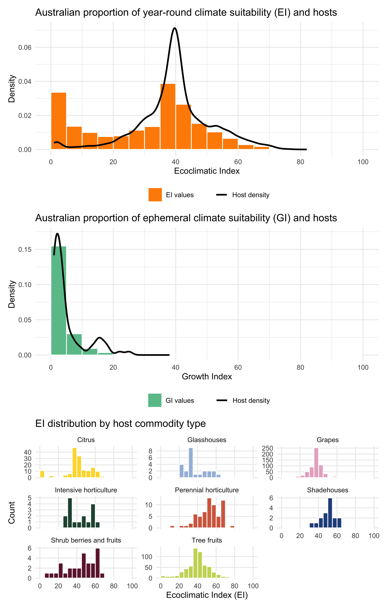
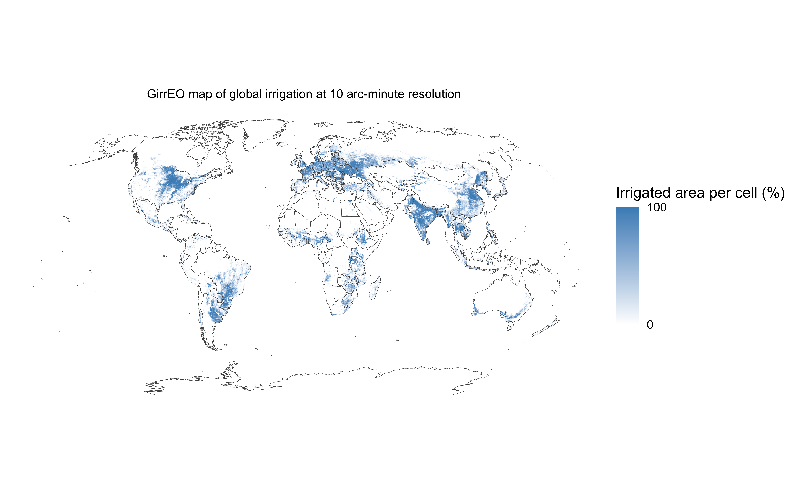
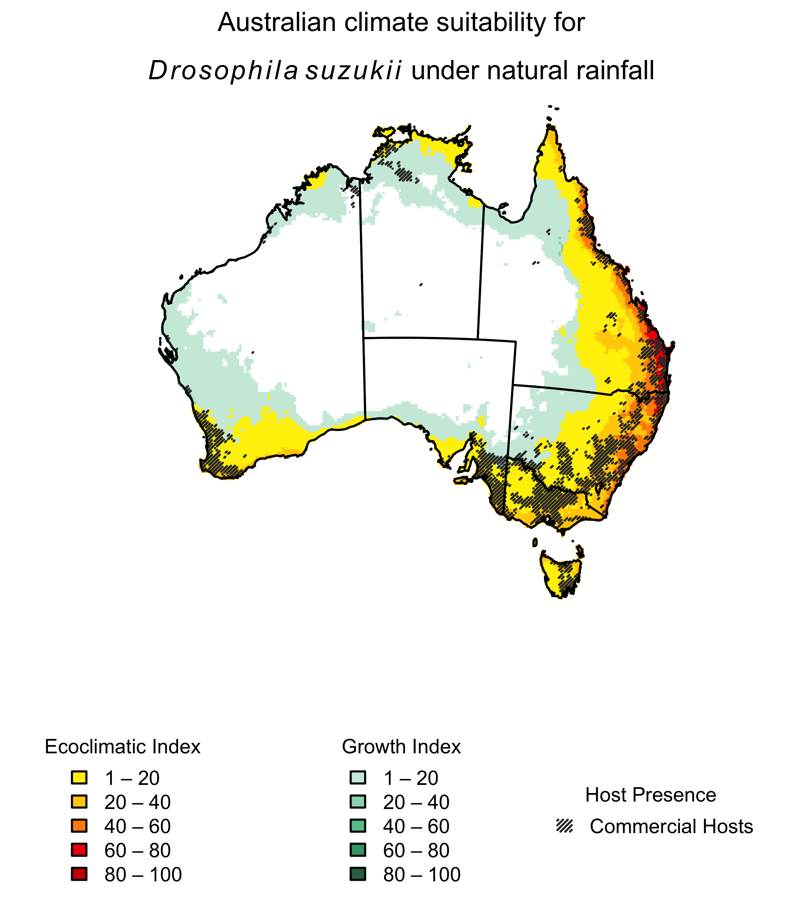

```{css, echo=FALSE}
.csl-entry { margin-bottom: 1.5em; }
```

### Rmd purposes

**Aim and context:** This Rmd file is used to map the global distribution via GBIF occurrence records of *Drosophila suzukii* against the CLIMEX model outputs of permanently and ephemerally suitable climates. The CLIMEX results for the Ecoclimatic Index (EI), Growth Index (GI, where generations \>1), and ephemeral suitability (GI\>0, generations \<1) are mapped as a composite of maximum values from the global area under irrigation (run under a 2.5mL daily top-up irrigation scenario and identified using GirrEO earth observation data), and the natural rainfall CLIMEX results. See @yonow2017 for an explanation of the logic involved in composite CLIMEX maps. For Australia, the composite CLIMEX results are overlain with the extent of commercial host growing regions as defined by ABARES.

**Output:** This file was used to map composite CLIMEX results and GBIF records for a global map, North America and Europe, and Australia.

**Note:** this Rmd file requires CLIMEX outputs of GI and EI, as well as GirrEO data from @lopezsaldana2025.

### Libraries and data setup

- Read in libraries
- Import both natural rainfall and irrigated scenario CLIMEX CSV files for a global extent
  - Run CLIMEX species model for CM10 World with Irrigation Not Set. Select Results \> File \> New \> Multiple.
  - Select Latitude, Longitude, EI, GI, and Generations, then save format and save as CSV within the R project folder.
  - Repeat for the irrigated dataset by changing Irrigation to 2.5 ml/day top-up for both summer and winter scenarios.
- Import global boundary file for mapping
- Import the GirrEO tif downloaded from @lopezsaldana2025
- Import Australian hosts data
- Import *Drosophila suzukii* shapefile and remove any duplicate records
- Identify how many records are removed and how many remain
- Set up Robinson projection
```{r setup}
library(rnaturalearth)     # global boundaries
library(rnaturalearthdata) # global boundaries
library(sp)                # GIS manipulation
library(terra)             # GIS manipulation
library(tidyterra) 
library(ozmaps)            # Australian boundaries
library(sf)                # GIS manipulation
library(dplyr)
library(ggplot2)
library(patchwork)
library(scales)

irrigated <- read.csv("../dsdata/D_suzukii_world_10_EI_GI_gens_irrigated.csv", skip = 2)
natural <- read.csv("../dsdata/D_suzukii_world_10_EI_GI_gens_none.csv", skip =2)

world_boundary <- ne_countries(scale = "medium", returnclass = "sf") # import global country boundaries
world_boundary <- vect(world_boundary)                               # convert to terra format
data("ozmap_states")                                                 # Australia State and Territory boundaries

girreo <- rast("../dsdata/Assimila_IrrigatedAreas_candidate_EVI_idx_Global_2023_irrigation_mask_0.1666667Deg.tif") # irrigation data

hosts <- rast("../dsdata/abares_hosts_by_commodity.tif")             # host data
hostcsv <- read.csv("../dsdata/abares_hosts_by_commodity_lookup.csv")

records <- vect("../dsdata/d.suzukii.shp")                           # read in GBIF records
sum(duplicated(crds(records)))                                       # n(exact duplicates)
sum(dup)                                                             # n(exact duplicates)
records <- terra::subset(records, !dup)                              # deduplicate
nrow(records)                                                        # n(records)

robinson <- "+proj=robin"
```

### Rasterise irrigated and non-irrigated outputs

- Convert CSV data to vector format as an interim, as the CLIMEX data are natively in vector format
- Set raster resolution, global limits, and CRS (WGS84, i.e. no projection)
- Convert vector data to raster data for plotting
  - Generations data will cover a wider range under an irrigated scenario where Dry Stress is reduced, so the natural data on Generations is moot
```{r rasterise}
irrigated_points <- vect(irrigated, geom=c("Longitude", "Latitude")) # vectorise CSV as an interim step
natural_points <- vect(natural, geom=c("Longitude", "Latitude"))     # vectorise CSV as an interim step

r_global <- rast(resolution=0.16667, xmin=-180, xmax=180, ymin=-90, ymax=90, crs="EPSG:4326") # 10 arc-min grid
irr_ei <- rasterize(irrigated_points, r_global, field="EI") # rasterise irrigated vector data to specified resolution for EI
irr_gi <- rasterize(irrigated_points, r_global, field="GI") # rasterise irrigated vector data to specified resolution for GI
nat_ei <- rasterize(natural_points, r_global, field="EI")   # rasterise natural vector data to specified resolution for EI
nat_gi <- rasterize(natural_points, r_global, field="GI")   # rasterise natural vector data to specified resolution for GI
generations <- rasterize(irrigated_points, r_global, field="Generations") # rasterise irrigated vector data to specified resolution for Generations
```

### Import GirrEO tif, map outputs for Supplementary Materials then clip to EI and GI

- Resample GirrEO extent to r_global
- Clip irrigated EI and GI to GirrEO dataset
- Clean zeros to NA in all rasters
```{r girreo}
girreo <- resample(girreo, r_global,  method="near")
irr_ei_clipped <- mask(irr_ei, girreo, maskvalues = 0)
irr_gi_clipped <- mask(irr_gi, girreo, maskvalues = 0)

nat_ei[nat_ei == 0] <- NA 
nat_gi[nat_gi == 0] <- NA
irr_ei_clipped[irr_ei_clipped == 0] <- NA
irr_gi_clipped[irr_gi_clipped == 0] <- NA
generations[generations == 0]     <- NA

world_boundary_robin <- project(world_boundary, robinson)
girreo_robin         <- project(girreo, robinson, method = "near")
girreo_robin_map     <- girreo_robin * 100
```

### Build composite EI, GI, and mutually exclusive display layers

- Overlay clipped irrigated EI onto EI w/natural rainfall.
- Set colours and breaks.
- Repeat for GI.
- Set values where generations \<1 but GI \>0
- Calculate irrigation summary statistics for EI 

```{r composites}
comp_ei <- max(nat_ei, irr_ei_clipped, na.rm=TRUE)
comp_ei[comp_ei == 0] <- NA
ei_breaks <- c(1, 20, 40, 60, 80, 100)
ei_cols <- c("#FEF001", "#FFCE03", "#FF8C00", "#F00505", "#CC0000")

comp_gi <- max(nat_gi, irr_gi_clipped, na.rm=TRUE)
comp_gi[comp_gi == 0] <- NA
gi_breaks <- c(1, 20, 40, 60, 80, 100)
gi_cols <- c("#CDEBDD", "#9CD6BB", "#6AC299", "#43A276", "#2F7152")

comp_gi_with_gens <- comp_gi            # EI = 0 + generations >= 1
comp_gi_with_gens[!is.na(comp_ei)] <- NA
comp_gi_with_gens[generations < 1] <- NA

no_generations <- comp_gi               # EI = 0 + generations < 1
no_generations[!is.na(comp_ei)] <- NA
no_generations[generations >= 1] <- NA
```

### Irrigation statistics for the world

- Substitutes NA → 0 in both rasters
- Calculate n(cells where irrigated comp0 > 0 and nat0 == 0, i.e. cells irrigation alone made suitable) / n(cells where comp0 > 0) 
- Calculate global area of EI increase under irrigation, restricted to cells already suitable under natural rainfall (i.e. beyond-range suitability changes)
- Calculate per-cell EI value increase where the cell was already irrigated (i.e. within-range suitability changes)

```{r irrigationstats}
nat0  <- terra::subst(nat_ei, NA, 0)                  # create "safe" versions for boolean comparison
comp0 <- terra::subst(comp_ei, NA, 0)                 # pre-masked comp_ei
pct_extension <- global((comp0 > 0) & (nat0 == 0), "sum", na.rm = TRUE)[1,1] / global(comp0 > 0, "sum", na.rm = TRUE)[1,1] * 100
pct_extension                                         # print

abs_increase <- comp_ei - nat_ei                      # identify cell values under irrigation
vals_abs <- terra::values(abs_increase, na.rm = TRUE) # exclude cells where nat_ei values == 0 
summary(vals_abs)                                     # print
```

### Classify GBIF occurrence records by suitability zone

- Classify points by continent
- Classify whether records fall within EI\>0, GI\>0 and generations \>1, GI\>0 and generations \<1, or none of the above
- Identify the number of: records on EI cells, records on GI cells, records on no-generations cells, and uncategorised records outside of the CLIMEX mapping extent

```{r gbifrecs}
world_boundary_buffered <- terra::buffer(world_boundary, width = 5000)   # 5 km buffer
region_info_unique <- region_info_unique[order(region_info_unique$id), ] # first match per record, in case of overlapping boundary buffers
records$continent <- region_info_unique$continent                      

ei_vals <- terra::extract(comp_ei, records)[,2]
gi_vals <- terra::extract(comp_gi_with_gens, records)[,2]
ng_vals <- terra::extract(no_generations, records)[,2]

uncategorised <- records[is.na(ei_vals) & is.na(gi_vals) & is.na(ng_vals), ]
ei_pts <- records[!is.na(ei_vals), ]
gi_pts <- records[is.na(ei_vals) & !is.na(gi_vals), ]
ng_pts <- records[is.na(ei_vals) & is.na(gi_vals) & !is.na(ng_vals), ]

nrow(uncategorised)
nrow(ei_pts)
nrow(gi_pts)
nrow(ng_pts)
```

### Project to Robinson and classify point type for plotting and tabulation

- Define Robinson projection
- Extend composite maps
- Project EI, GI, Generations, records, and world boundary
- Set type labels
- Calculate raw numbers and proportions
```{r robinson, message = FALSE, warning = FALSE}
comp_ei_robin <- project(comp_ei, robinson, method="near")
comp_gi_robin <- project(comp_gi_with_gens, robinson, method="near")
no_generations_robin <- project(no_generations, robinson, method="near")
ei_pts_robin <- project(ei_pts, robinson)
gi_pts_robin <- project(gi_pts, robinson)
ng_pts_robin <- project(ng_pts, robinson)

ei_pts_robin$type <- "Record on EI"
gi_pts_robin$type <- "Record on GI"
ng_pts_robin$type <- "Record on GI <1 gen"
plotted <- rbind(ei_pts_robin, gi_pts_robin, ng_pts_robin)
counts_tab <- table(plotted$continent, plotted$type)
counts_tab
prop_tab <- prop.table(counts_tab, margin = 1) * 100
round(prop_tab, 2)
nrow(plotted)
```

### Set North American and European projections

- Disaggregate rasters to ensure fine-scale raster projections, especially important in the Alps
- Project rasters under fine-scale to North America and Europe local projections
- Project region boundaries to North America and Europe local projections
- Project records to North America and Europe local projections
- Mask rasters to region boundaries post-projection

```{r reprojections, message = FALSE, warning = FALSE}
comp_ei_fine <- disagg(comp_ei, fact = 4, method = "near")
comp_gi_fine <- disagg(comp_gi_with_gens, fact = 4, method = "near")
no_generations_fine <- disagg(no_generations, fact = 4, method = "near")

comp_ei_nad <- project(comp_ei_fine, "ESRI:102008", method="near") # North America
comp_gi_nad <- project(comp_gi_fine, "ESRI:102008", method="near")
no_generations_nad <- project(no_generations_fine, "ESRI:102008", method="near")

nam_boundary <- ne_countries(continent = "North America", scale = "medium", returnclass = "sf")
nam_boundary <- vect(nam_boundary)
nam_boundary_nad <- project(nam_boundary, "ESRI:102008")
ei_pts_nad <- project(ei_pts, "ESRI:102008")
gi_pts_nad <- project(gi_pts, "ESRI:102008")
ng_pts_nad <- project(ng_pts, "ESRI:102008")

nad_ei <- mask(crop(comp_ei_nad, nam_boundary_nad), nam_boundary_nad)
nad_gi <- mask(crop(comp_gi_nad, nam_boundary_nad), nam_boundary_nad)
no_generations_nad <- mask(crop(no_generations_nad, nam_boundary_nad), nam_boundary_nad)

comp_ei_euro <- project(comp_ei_fine, "EPSG:3035", method="near") # Europe
comp_gi_euro <- project(comp_gi_fine, "EPSG:3035", method="near")
no_generations_euro <- project(no_generations_fine, "EPSG:3035", method="near")

euro_boundary <- ne_countries(continent = "Europe", scale = "medium", returnclass = "sf")
euro_boundary <- vect(euro_boundary)
euro_boundary_ETRS89 <- project(euro_boundary, "EPSG:3035")
ei_pts_euro <- project(ei_pts, "EPSG:3035")
gi_pts_euro <- project(gi_pts, "EPSG:3035")
ng_pts_euro <- project(ng_pts, "EPSG:3035")

euro_ei <- mask(crop(comp_ei_euro, euro_boundary_ETRS89), euro_boundary_ETRS89)
euro_gi <- mask(crop(comp_gi_euro, euro_boundary_ETRS89), euro_boundary_ETRS89)
no_generations_euro <- mask(crop(no_generations_euro, euro_boundary_ETRS89), euro_boundary_ETRS89)
```

### Map global record distribution and CLIMEX results, with insets of North America and Europe

```{r figure2}
png("../dsoutputs/D.suzukii_combined.png", units="in", width=8, height=9, res=750)
layout(matrix(c(1, 1,
                 2, 2,
                 3, 4), nrow = 3, byrow = TRUE),
       heights = c(0.45, 0.12, 0.43))

par(mar = c(0, 1, 2, 1)) # global map
plot(comp_gi_robin, col=gi_cols, breaks=gi_breaks, maxcell=Inf,
     main=expression('A. Global composite climate suitability for '*italic(Drosophila~suzukii)*' with GBIF records'),
     legend=FALSE, axes=FALSE, cex.main = 0.9)
plot(no_generations_robin, col=c("lightpink"), add=TRUE, legend=FALSE, maxcell=Inf)
plot(comp_ei_robin, col=ei_cols, breaks=ei_breaks, add=TRUE, legend=FALSE, maxcell=Inf)
plot(world_boundary_robin, add = TRUE, border = "black", lwd = 0.4)
plot(ei_pts_robin, col="darkblue", cex=0.35, pch=16, legend=FALSE, add=TRUE)
plot(gi_pts_robin, col="chocolate4", cex=0.35, pch=16, legend=FALSE, add=TRUE)
plot(ng_pts_robin, col="darkorchid1", cex=0.35, pch=16, legend=FALSE, add=TRUE)

par(mar = c(0, 0, 0, 0)) # shared legend across middle
plot(1, type = "n", axes = FALSE, xlab = "", ylab = "", ylim = c(0, 1))
legend("left", inset = c(0.2, 0),
       legend = paste(ei_breaks[-length(ei_breaks)], ei_breaks[-1], sep = " – "),
       fill = ei_cols, title = "Ecoclimatic Index", bty = "n", cex = 0.8, horiz = FALSE)
legend("center", 
       legend = paste(gi_breaks[-length(gi_breaks)], gi_breaks[-1], sep = " – "),
       fill = gi_cols, title = "Growth Index", bty = "n", cex = 0.8, horiz = FALSE)
legend("right", inset = c(0.15, 0),
       legend = c("Record on EI", "Record on GI only", "Record on GI <1 gen", "GI >0 and Generations <1"),
       pch = c(16, 16, 16, 15),
       col = c("darkblue", "chocolate4", "darkorchid1", "lightpink"),
       pt.cex = c(0.6, 0.6, 0.6, 1.5),
       bty = "n", cex = 0.8, horiz = FALSE)

par(mar = c(0, 2, 2, 1)) # North America
plot(nad_gi, col = gi_cols, breaks = gi_breaks,
     main = expression('B. North American composite climate suitability for '*italic(Drosophila~suzukii)),
     legend = FALSE, axes = FALSE, cex.main = 0.8)
plot(no_generations_nad, col = c("lightpink"), add = TRUE, legend = FALSE)
plot(nad_ei, col = ei_cols, breaks = ei_breaks, add = TRUE, legend = FALSE)
plot(ei_pts_nad, col="darkblue", cex=0.4, pch=16, legend=FALSE, add=TRUE)
plot(gi_pts_nad, col="chocolate4", cex=0.4, pch=16, legend=FALSE, add=TRUE)
plot(nam_boundary_nad, add = TRUE, border = "black", lwd = 0.4)

par(mar = c(0, 1, 2, 2)) # Europe
plot(euro_gi, col = gi_cols, breaks = gi_breaks,
     main = expression('C. European composite climate suitability for '*italic(Drosophila~suzukii)),
     xlim = c(2500000, 6500000), ylim = c(1300000, 5500000),
     legend = FALSE, axes = FALSE, cex.main = 0.8)
plot(no_generations_euro, col = c("lightpink"), add = TRUE, legend = FALSE)
plot(euro_ei, col = ei_cols, breaks = ei_breaks, add = TRUE, legend = FALSE)
plot(ei_pts_euro, col="darkblue", cex=0.4, pch=16, legend=FALSE, add=TRUE)
plot(gi_pts_euro, col="chocolate4", cex=0.4, pch=16, legend=FALSE, add=TRUE)
plot(ng_pts_euro, col="darkorchid1", cex=0.4, pch=16, legend=FALSE, add=TRUE)
plot(euro_boundary_ETRS89, add = TRUE, border = "black", lwd = 0.4)

invisible(dev.off())
knitr::include_graphics("../dsoutputs/D.suzukii_combined.png")
```

### Set Australian Albers reprojection

- Reproject composite rasters to Australian Albers, and natural rasters to visually demonstrate the effects of irrigation
- Reproject Australia boundary to Australian Albers
- Clip EI and GI rasters to Aus boundary file.
- Reproject hosts to Australian Albers
- Mask to Australian boundary to ensure a clean outline

```{r ausalbers, message = FALSE, warning = FALSE}
comp_ei_albers <- project(comp_ei, "EPSG:3577", method="near")
comp_gi_albers <- project(comp_gi_with_gens, "EPSG:3577", method="near")

nat_ei_albers <- project(nat_ei, "EPSG:3577", method="near")
nat_gi_albers <- project(nat_gi, "EPSG:3577", method="near")

aus_boundary <- ne_countries(country = "Australia",  scale = "medium", returnclass = "sf")
aus_boundary <- vect(aus_boundary)
aus_boundary_albers <- project(aus_boundary, "EPSG:3577")

aus_states <- ozmap_states
aus_states <- vect(aus_states)
aus_states_albers <- project(aus_states, "EPSG:3577")

aus_ei <- crop(comp_ei_albers, aus_boundary_albers) # reduces extent to the bounding box of Australia
aus_ei <- mask(aus_ei, aus_boundary_albers)         # NA values outside Australia polygon
aus_gi <- crop(comp_gi_albers, aus_boundary_albers)
aus_gi <- mask(aus_gi, aus_boundary_albers)
aus_ei_nat <- crop(nat_ei_albers, aus_boundary_albers) # rasters without irrigation
aus_ei_nat <- mask(aus_ei_nat, aus_boundary_albers)
aus_gi_nat <- crop(nat_gi_albers, aus_boundary_albers)
aus_gi_nat <- mask(aus_gi_nat, aus_boundary_albers)

hosts_albers <- project(hosts, "EPSG:3577", method="near")
hosts_ei_aligned <- resample(hosts_albers, aus_ei, method = "near")
hosts_bin <- !is.na(hosts_albers)
hosts_bin <- mask(hosts_bin, aus_boundary_albers)
hosts_bin[hosts_bin == 0] <- NA
cross.host <- as.polygons(hosts_bin, dissolve = FALSE)
```

### Australian irrigation statistics

- Calculate the proportional range extension within Australia (to demonstrate EI range expansion)
- Calculate per-cell EI increase, restricted to cells already suitable under natural rainfall
```{r ausirrigationstats}
aus_nat0  <- terra::subst(aus_ei_nat, NA, 0)
aus_comp0 <- terra::subst(aus_ei, NA, 0)
aus_pct_extension <- global((aus_comp0 > 0) & (aus_nat0 == 0), "sum", na.rm = TRUE)[1,1] /
                     global(aus_comp0 > 0, "sum", na.rm = TRUE)[1,1] * 100
aus_pct_extension

aus_abs_increase <- aus_ei - aus_ei_nat
aus_vals_abs <- terra::values(aus_abs_increase, na.rm = TRUE)
summary(aus_vals_abs)
```

### Map Australian EI and GI results and host availability, for the composite irrigation map 
```{r figure3}
png("../dsoutputs/D.suzukii_aus.png", units="in", width=4, height=4, res=700)
layout(matrix(c(1, 2), nrow = 2, byrow = TRUE), heights = c(0.8, 0.2)) # 2 plots on top, 1 legend area below

par(mar = c(0, 0, 0, 0)) #plot composite map with hosts
plot(aus_gi, col=gi_cols, breaks=gi_breaks,
     main=expression('Australian composite climate suitability for '*italic(Drosophila~suzukii)*''),
     legend=FALSE, axes=FALSE, cex.main = 0.8,
     xlim=c(-2500000, 2500000), ylim=c(-5000000, -1000000))
plot(aus_ei, col=ei_cols, breaks=ei_breaks, add=TRUE, legend=FALSE)
plot(cross.host, density = 60, angle = 45, add=TRUE, border = NA, col = adjustcolor("grey20"))
lines(aus_boundary_albers, col="black", lwd=1)  # Use aus_boundary_albers here!
lines(aus_states_albers, col="black", lwd=1)

par(mar = c(0, 1, 0, 1))
plot(1, type = "n", axes = FALSE, xlab = "", ylab = "")

legend("left", inset = c(0, 0),
       legend = paste(ei_breaks[-length(ei_breaks)], ei_breaks[-1], sep = " – "),
       fill = ei_cols, title = "Ecoclimatic Index", bty = "n", cex = 0.6, horiz = FALSE)
legend("center", 
       legend = paste(gi_breaks[-length(gi_breaks)], gi_breaks[-1], sep = " – "),
       fill = gi_cols, title = "Growth Index", bty = "n", cex = 0.6, horiz = FALSE)
legend("right", inset = c(0, 0),
       legend = c("Commercial Hosts"),
       density = 60, angle = 45,
       fill = adjustcolor("grey20"), border=NA, title = "Host Presence", bty = "n", cex=0.6, xpd=TRUE)
invisible(dev.off())
knitr::include_graphics("../dsoutputs/D.suzukii_aus.png")
```

### Overlap of climate suitability and host availability
- Define all Australian EI and GI cells and mask to hosts
- Set histogram breaks
- Histogram of all EI values across Australia plus host density
- Histogram of all GI values across Australia plus host density
- Histogram of host commodity EI values 
```{r figure4}
ei_vals_all <- values(aus_ei, na.rm = TRUE)
ei_df_all   <- data.frame(EI = as.vector(ei_vals_all))
gi_vals_all <- values(aus_gi, na.rm = TRUE)
gi_df_all   <- data.frame(GI = as.vector(gi_vals_all))

ei_host_mask  <- mask(aus_ei, hosts_ei_aligned)
ei_vals_hosts <- values(ei_host_mask, na.rm = TRUE)
ei_df_hosts   <- data.frame(EI = as.vector(ei_vals_hosts))

gi_host_mask  <- mask(aus_gi, hosts_ei_aligned)  
gi_vals_hosts <- values(gi_host_mask, na.rm = TRUE)
gi_df_hosts   <- data.frame(GI = as.vector(gi_vals_hosts))

png("../dsoutputs/hosteis.png", units = "in", width = 7, height = 11, res =700)
ei_breaks <- seq(0, 100, by = 5)
ei_axis_breaks <- seq(0, 100, by = 20)                     # labelling only

p1 <- ggplot() +
  geom_histogram(data = ei_df_all, aes(x = EI, y = after_stat(density), fill = "EI values"),
                 breaks = ei_breaks, colour = "white", key_glyph = "rect") +
  geom_density(data = ei_df_hosts, aes(x = EI, colour = "Host density"),
               linewidth = 1, key_glyph = "path") +
  scale_fill_manual(name = "", values = c("EI values" = "#FF8C00")) +
  scale_colour_manual(name = "", values = c("Host density" = "black")) +
  scale_x_continuous(breaks = ei_axis_breaks) +
  guides(fill = guide_legend(title = "", order = 1, override.aes = list(colour = NA)),
         colour = guide_legend(title = "", order = 2)) +
  labs(title = "Australian proportion of year-round climate suitability (EI) and hosts",
       x = "Ecoclimatic Index", y = "Density") +
  theme_minimal() +
  theme(legend.position = "bottom")

gi_breaks <- seq(0, 100, by = 5)   
p2 <- ggplot() +
  geom_histogram(data = gi_df_all, aes(x = GI, y = after_stat(density), fill = "GI values"),
                 breaks = gi_breaks, colour = "white", key_glyph = "rect") +
  geom_density(data = gi_df_hosts, aes(x = GI, colour = "Host density"),
               linewidth = 1, key_glyph = "path") +
  scale_fill_manual(name = "", values = c("GI values" = "#6AC299")) +
  scale_colour_manual(name = "", values = c("Host density" = "black")) +
  scale_x_continuous(breaks = ei_axis_breaks) +
  guides(fill = guide_legend(title = "", order = 1, override.aes = list(colour = NA)),
         colour = guide_legend(title = "", order = 2)) +
  labs(title = "Australian proportion of ephemeral climate suitability (GI) and hosts",
       x = "Growth Index", y = "Density") +
  theme_minimal() +
  theme(legend.position = "bottom")

ei_vals   <- values(aus_ei, na.rm = FALSE)
host_vals <- values(hosts_ei_aligned, na.rm = FALSE)
combo <- data.frame(EI = as.vector(ei_vals), host_code = as.vector(host_vals)) %>%
  filter(!is.na(EI), !is.na(host_code)) %>%
  left_join(hostcsv, by = c("host_code" = "Value"))

host_colours <- c(
  "Perennial horticulture"   = "#d76a4c",
  "Tree fruits"              = "#c9d763",
  "Shrub berries and fruits" = "#6e1e3a",
  "Citrus"                   = "#ffd932",
  "Grapes"                   = "#e9b0c8",
  "Intensive horticulture"   = "#25533f",
  "Shadehouses"              = "#274f8b",
  "Glasshouses"              = "#a4bde0")

p3 <- ggplot(combo, aes(x = EI, fill = host_type)) +
  geom_histogram(breaks = ei_breaks, colour = "white") +   # bars every 10
  scale_fill_manual(values = host_colours) +
  scale_x_continuous(breaks = ei_axis_breaks) +            # labels every 20
  scale_y_continuous(breaks = scales::breaks_pretty(n = 4)) +
  facet_wrap(~ host_type, scales = "free_y") +
  labs(title = "EI distribution by host commodity type",
       x = "Ecoclimatic Index (EI)", y = "Count") +
  theme_minimal() +
  theme(legend.position = "none",
        panel.grid.minor = element_blank())

p1 / p2 / p3
invisible(dev.off())


```

GirrEO map (Supplementary Materials)
```{r suppfig1}
png("../dsoutputs/GirrEO.png", units="in", width=8, height=5, res=700)
ggplot() +
  geom_spatraster(data = girreo_robin_map, na.rm = TRUE) +
  scale_fill_gradient(name = "Irrigated area per cell (%)", low = "#FFF", 
                      high = "#478EC1", na.value = "transparent", breaks = c(0, 100)) +
  geom_sf(data = world_boundary_robin, fill = NA, colour = "grey30", linewidth = 0.1) +
  labs(title = "GirrEO map of global irrigation at 10 arc-minute resolution") +
  theme_void() +
  theme(plot.title = element_text(size =9, hjust = 0.5))

invisible(dev.off())

```

Map Australian EI and GI results and host availability, for natural rainfall (Supplementary Materials)
```{r suppfig2}
png("../dsoutputs/D.suzukii_aus_sm.png", units="in", width=4, height=4.5, res=700)
layout(matrix(c(1, 2), nrow = 2, byrow = TRUE), heights = c(0.8, 0.2)) # 2 plots on top, 1 legend area below

par(mar = c(0, 0, 0, 0)) #plot composite map with hosts
plot(aus_gi_nat, col=gi_cols, breaks=gi_breaks, 
     main=expression(atop('Australian climate suitability for', 
                           italic(Drosophila~suzukii)*' under natural rainfall')),
     legend=FALSE, axes=FALSE, cex.main = 0.8,
     xlim=c(-2500000, 2500000), ylim=c(-5000000, -1000000))
plot(aus_ei_nat, col=ei_cols, breaks=ei_breaks, add=TRUE, legend=FALSE)
plot(cross.host, density = 60, angle = 45, add=TRUE, border = NA, col = adjustcolor("grey20"))
lines(aus_boundary_albers, col="black", lwd=1)  # Use aus_boundary_albers here!
lines(aus_states_albers, col="black", lwd=1)

par(mar = c(0, 1, 0, 1))
plot(1, type = "n", axes = FALSE, xlab = "", ylab = "")

legend("left", inset = c(0, 0),
       legend = paste(ei_breaks[-length(ei_breaks)], ei_breaks[-1], sep = " – "),
       fill = ei_cols, title = "Ecoclimatic Index", bty = "n", cex = 0.6, horiz = FALSE)
legend("center", 
       legend = paste(gi_breaks[-length(gi_breaks)], gi_breaks[-1], sep = " – "),
       fill = gi_cols, title = "Growth Index", bty = "n", cex = 0.6, horiz = FALSE)
legend("right", inset = c(0, 0),
       legend = c("Commercial Hosts"),
       density = 60, angle = 45,
       fill = adjustcolor("grey20"), border=NA, title = "Host Presence", bty = "n", cex=0.6, xpd=TRUE)
invisible(dev.off())

```

### References